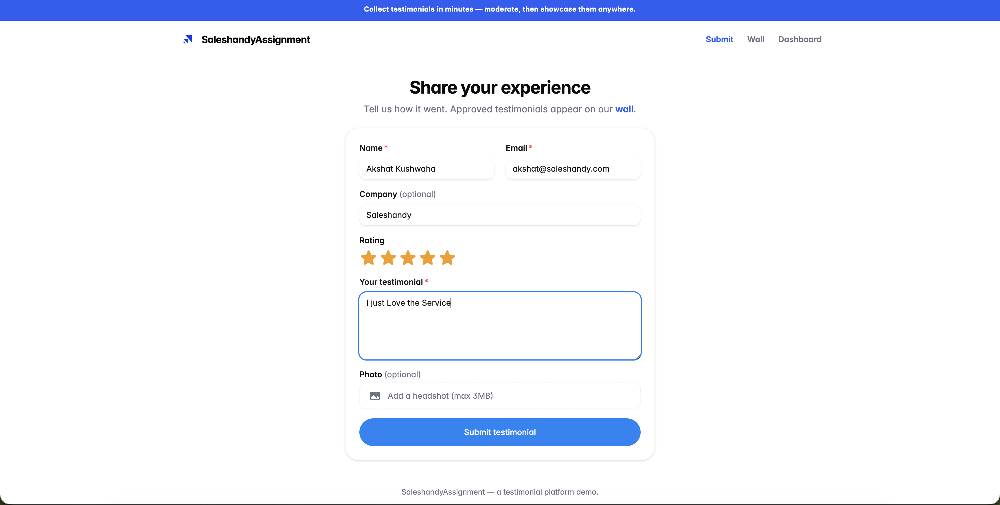
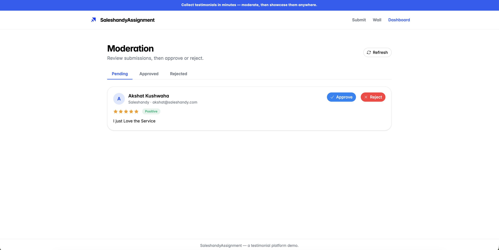
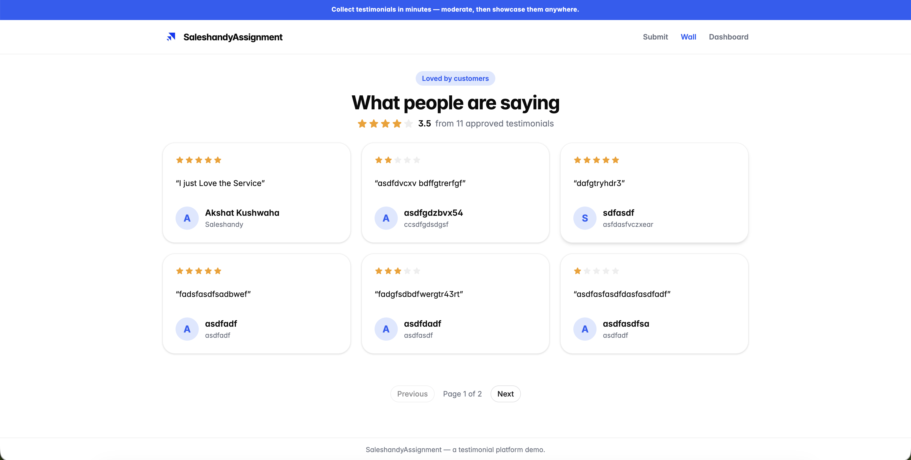

# Testimonial Platform

Collect customer testimonials, moderate them, and show the approved ones on a public wall
and an **embeddable widget** you can drop onto any website.

Submit → moderate → approve → it appears on the wall & widget. Rejected ones never surface publicly.

## Screenshots

| Submit | Dashboard (moderation) | Public wall |
|--------|------------------------|-------------|
|  |  |  |

## Stack
- **Frontend:** React 19 + Vite · TailwindCSS v4 · HeroUI v3 · Heroicons · react-router
- **Backend:** Node + Express · SQLite (better-sqlite3) · multer (photo upload)
- **AI (optional):** Google Gemini — sentiment tag + one-line summary per testimonial

## Run locally
```bash
npm run install:all      # installs root, server, and web deps
npm run dev              # server on :4000, web on :5173
```
Open:
- **http://localhost:5173/** — submission form
- **http://localhost:5173/dashboard** — moderation (approve / reject)
- **http://localhost:5173/wall** — public wall of approved testimonials

### Enable the AI feature (optional)
```bash
cp .env.example server/.env
# put your free Google AI Studio key in server/.env: GEMINI_API_KEY=...
```
Without a key the app works exactly the same — the sentiment/summary just stay empty.
Uses `gemini-flash-latest` by default; override with `GEMINI_MODEL` in `server/.env` if needed.

### The embeddable widget
Any third-party site embeds approved testimonials with two tags:
```html
<div id="testimonials"></div>
<script src="http://localhost:4000/widget.js"
        data-target="testimonials" data-accent="#275DF5" data-limit="6"></script>
```
A working demo on a standalone HTML page lives at `web/public/embed-demo.html`
(open it via a different origin, e.g. `npx serve web/public`, to prove cross-site embedding).

## API
| Method | Path | Purpose |
|--------|------|---------|
| POST | `/api/testimonials` | Public submit (multipart; optional photo). Validates + dedups. |
| GET | `/api/testimonials?status=&page=&limit=` | Dashboard list. |
| GET | `/api/testimonials/public?page=&limit=` | **Approved only** — wall + widget. |
| PATCH | `/api/testimonials/:id` | `{status:"approved"\|"rejected"}` |
| GET | `/widget.js` | The embeddable script. |

## What's done / not done
See **JOURNAL.md** for the full decision log, prioritization, and AI-collaboration notes.

- ✅ P0: submission form, API + SQLite, moderation dashboard, public wall
- ✅ P1: embeddable widget + demo page, accent-color customization, duplicate/junk handling, pagination, empty/loading/error states
- ✅ P2: AI sentiment + summary (Gemini)
- ⛔ Not built (assignment non-goals): auth, payments, multi-business, roles, email
- ⛔ No live deploy — but two-project Vercel config is committed (see below)

## Deploy (two Vercel projects, config included)
Frontend and backend deploy as **two separate Vercel projects** from this one repo,
each with its own Root Directory:

**Backend project** (`server/vercel.json`)
- Root Directory: **`server`**
- Bundles the native `better-sqlite3` binary via `includeFiles`; runs `index.js` as a
  serverless function. Node pinned to 22 (`engines` in `server/package.json`).
- Env vars: **`FRONTEND_URL`** = your frontend URL (comma-separated for multiple; drives
  CORS). Optional **`GEMINI_API_KEY`** for AI sentiment/summary.
- ⚠️ SQLite lives in `/tmp` on Vercel — **ephemeral**: data resets on cold starts. Fine for
  a demo. For durable data, deploy the backend on a host with a disk (Render) or swap
  SQLite for Neon/Postgres.

**Frontend project** (`web/vercel.json`)
- Root Directory: **`web`** — SPA rewrites to `index.html`, builds to `dist`.
- Env var: **`VITE_API_URL`** = the backend project's URL. Vite inlines this **at build
  time**, so set it *before* deploying and redeploy after any change. If unset, the app
  calls `/api` on its own domain and every request fails.

Flow: deploy the backend project → copy its URL → set `VITE_API_URL` on the frontend
project (and point the widget `src` at the backend `/widget.js`) → deploy the frontend →
set `FRONTEND_URL` on the backend to the frontend URL. Locally, leave `VITE_API_URL` empty
and Vite proxies `/api` to `:4000`. The public wall/widget endpoints use open CORS so the
widget loads on any third-party site; dashboard routes stay restricted to `FRONTEND_URL`.

## Notes
- No authentication by design — the dashboard is intentionally open (assignment non-goal).
